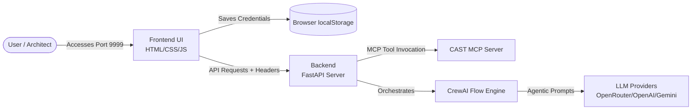

<div align="center">
  
</div>

# Archaion Analyzer

**Archaion Analyzer** is the **first agentic application** powered by the **CAST Imaging MCP (Model Context Protocol)**. It is a standalone, AI-driven platform designed to help developers and architects evaluate legacy software. It connects to the CAST MCP Server to pull detailed architectural statistics (like lines of code, element types, and sensitive data detection), and orchestrates **Artificial Intelligence (LLMs like OpenAI, Google Gemini, or OpenRouter via CrewAI)** to autonomously generate comprehensive modernization plans and cloud strategy recommendations.

## 🔗 Links
- Docker Hub Image: https://hub.docker.com/r/theabhisheksinha/archaion-analyzer
- GitHub Repository: https://github.com/theabhisheksinha/Archaion
- Developer Docs: `playbook.md`, `agentic_workflow.md`

---

## 🛑 Important License Notice
Before using this software, please read the [LICENSE.md](LICENSE.md).
- You **must give credit** to the original author if you use or modify this project.
- You **must obtain explicit permission** from the author before distributing this software (commercially or non-commercially) or hosting it publicly.

---

## 🌟 Key Features
- **Standalone Design:** Everything runs on a single server (Port **9999**). The visual user interface (frontend) and the data engine (backend) are bundled together.
- **No Coding Required:** You do not need to edit any code or `.env` files to connect your tools. The application has a "Settings" button right on the web page where you can safely paste your CAST MCP connection details and your AI keys.
- **Privacy-First:** Your API keys are saved locally in your own browser. The server does not permanently store them, meaning you can safely deploy this tool for your team to use with their own personal keys.
- **Docker-Ready with Log Management:** The Docker setup natively handles log rotation to ensure your host machine never runs out of space.

---

## 🏗 Architecture at a Glance



*(For a deep-dive into the technical architecture and component breakdown, please refer to the `playbook.md` file.)*

---

## 📋 Essential Prerequisites
To use Archaion Analyzer, you must bring your own connection details for two external services. The application acts as a bridge between them but does not provide them for you:

### 1. CAST Software MCP
You must have an active connection to a **CAST Imaging MCP Server**.
- **Version Compatibility:** Archaion requires CAST MCP **v3 or higher**.
- **Credentials:** You will need your organization's specific MCP Server URL and your personal `X-API-KEY` provided by CAST Software.

### 2. Artificial Intelligence (LLM) API Key
Archaion uses generative AI to analyze the architectural statistics and generate the final modernization report. You must provide an API Key from one of the following supported AI providers:
- **OpenAI** (Uses the `gpt-4o` model)
- **Azure AI** (Uses the `azure/gpt-4o` model; requires your Azure endpoint and deployment name configuration)
- **Google Gemini** (Uses the `gemini-1.5-pro` model)
- **OpenRouter** (Uses the `gemini-2.5-flash` model for high-speed routing)

---

## 🚀 How to Install and Run

There are two main ways to run this application. You can use **Docker** (the easiest and most reliable method), or you can install it directly onto your computer (**Local Setup**).

### Method 1: Running with Docker (Recommended for all platforms)
Docker packages the application so you don't have to worry about installing the right version of Python.

**Requirements:**
- Download and install [Docker Desktop](https://www.docker.com/products/docker-desktop/).

#### Option A: Run the Published Docker Image (Docker Hub)
If you want the simplest experience (no source build), use the published image:

```bash
docker pull theabhisheksinha/archaion-analyzer:latest
docker run --rm -p 9999:9999 --name archaion-analyzer theabhisheksinha/archaion-analyzer:latest
```

Open your browser: `http://localhost:9999`

**Optional environment variables (fallback defaults):**
If you want to provide defaults via `.env` (UI Settings still take priority):

```bash
docker run --rm -p 9999:9999 --env-file .env --name archaion-analyzer theabhisheksinha/archaion-analyzer:latest
```

#### Option B: Build \& Run from Source (Docker Compose)
**Steps:**
1. Open your computer's terminal (Command Prompt/PowerShell on Windows, or Terminal on Mac/Linux).
2. Navigate to the Archaion project folder.
3. *(Optional)* If you want to hardcode environment variables instead of using the UI, copy `.env.example` to `.env` and fill in your details.
4. Run the following command:
   ```bash
   docker-compose up --build -d
   ```
5. Wait a minute for it to finish setting up.
6. Open your web browser and go to: `http://localhost:9999`

To stop the application, run `docker-compose down`.

---

### 🏷️ Docker Image Tags
Archaion follows a simple tagging strategy:
- `latest`: Most recent stable release.
- `0.1.0`: Immutable release tag (recommended for production pinning).
- `0.1`: Optional rolling minor tag (points to the latest `0.1.x` release, if published).

---

### Method 2: Local Installation (Without Docker)

If you prefer not to use Docker, you can run the application directly using Python.

**Requirements for all systems:**
- You must have **Python 3.11 or 3.12** installed on your computer.

#### 🪟 Instructions for Windows:
1. Open **PowerShell**.
2. Navigate to the Archaion folder:
   ```powershell
   cd C:\path\to\Archaion
   ```
3. Create a virtual environment (this keeps the application files isolated from the rest of your computer):
   ```powershell
   python -m venv venv
   ```
4. Activate the virtual environment:
   ```powershell
   .\venv\Scripts\Activate.ps1
   ```
   *(If you get a red error about "Execution Policies", run this command first: `Set-ExecutionPolicy -Scope CurrentUser -ExecutionPolicy RemoteSigned` and try step 4 again).*
5. Install the required files:
   ```powershell
   pip install -r requirements.txt
   ```
6. Start the application:
   ```powershell
   python -m uvicorn app.backend.main:app --host 0.0.0.0 --port 9999
   ```
7. Open your web browser and go to: `http://localhost:9999`

#### 🍎 Instructions for macOS and Linux:
1. Open the **Terminal**.
2. Navigate to the Archaion folder:
   ```bash
   cd /path/to/Archaion
   ```
3. Create a virtual environment:
   ```bash
   python3 -m venv venv
   ```
4. Activate the virtual environment:
   ```bash
   source venv/bin/activate
   ```
5. Install the required files:
   ```bash
   pip install -r requirements.txt
   ```
6. Start the application:
   ```bash
   python -m uvicorn app.backend.main:app --host 0.0.0.0 --port 9999
   ```
7. Open your web browser and go to: `http://localhost:9999`

---

## ⚙️ How to Use the Application

Once you have opened `http://localhost:9999` in your web browser:
1. Click the **"⚙" (Gear Icon)** button in the top right corner.
2. Enter your **CAST MCP URL** (e.g., `http://your-company.castsoftware.com/mcp`).
3. Enter your **CAST MCP X-API-KEY**.
4. Select your preferred **LLM Provider** from the dropdown menu (e.g., OpenRouter, OpenAI, Google Gemini).
5. Enter your personal **LLM API Key** for the provider you selected.
6. Click **Save Configuration**.

The application will immediately connect to your MCP server and populate the left-hand column with all your available applications! Click on any application to view its technical profile, fill out the modernization scope form, and click "Initialize Agents" to watch the AI write a custom modernization report for you.
