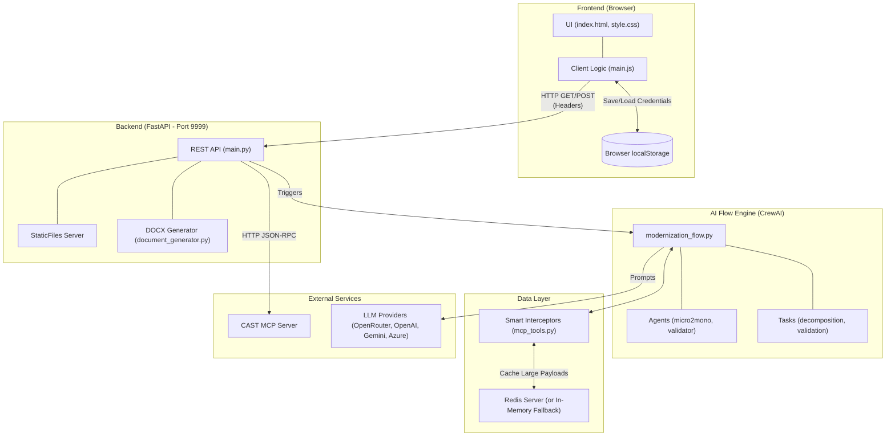

# Archaion Developer Playbook

Welcome to the internal developer guide for the Archaion Analyzer. This document covers how the architecture works, how to troubleshoot issues, and how to understand the data flow. 

*(If you are just looking for instructions on how to install and run the app, please read the `README.md` file instead).*

## 🔗 References
- Docker Hub Image: https://hub.docker.com/r/theabhisheksinha/archaion-analyzer
- GitHub Repository: https://github.com/theabhisheksinha/Archaion
- Agentic Workflow Guide: `agentic_workflow.md`

---

## 🏛 Architecture Overview

Archaion is designed as a **Stateless, Standalone Monolith** running entirely on Python. It securely bridges the gap between external code intelligence (CAST MCP) and generative artificial intelligence (LLMs).

### System Architecture Diagram

---

## 🧩 Detailed Component Breakdown

### 1. Frontend (`app/frontend/`)
- **`index.html` & `style.css`**: Defines the user interface using a Glassmorphism design.
- **`main.js`**: Handles dynamic user interactions. Normalizes LLM-generated HTML (like `<strong>` tags) back to Markdown and renders robust HTML tables.
- **State Management**: Uses `localStorage` to securely save the user's CAST API keys and LLM keys locally in the browser.

### 2. Backend (`app/backend/`)
- **`main.py`**: Acts as the central router. Mounts the frontend using `StaticFiles`.
- **`redis_manager.py`**: Manages async Redis connections. It includes an **In-Memory Fallback** (`_fallback_store` dict) so the application can run perfectly on local development machines without a Dockerized Redis instance.

### 3. AI Flow Engine (`app/flows/`, `app/agents/`, `app/tools/`)
- **`modernization_flow.py`**: A wrapper that initializes a **CrewAI** multi-agent system. It assigns a unique UUID (`execution_id`) to every run to namespace data. It extracts token usage metrics (`usage_metrics`) and appends them to the final report.
- **`app/agents/config/`**: YAML definitions for roles (e.g., `architecture_analyst`) and tasks (e.g., `synthesis_report_task`).
- **Smart Interceptors (`app/tools/mcp_tools.py`)**: To prevent LLM context window blowouts from massive CAST MCP JSON payloads, these Pydantic-validated tool wrappers intercept the response, store the heavy JSON in Redis, and return a tiny, token-efficient summary to the LLM.
- **DOCX Generator (`app/tools/document_generator.py`)**: Converts the final LLM Markdown report into a native Microsoft Word document. It safely parses tables, headers, bold text, and code snippets into native `python-docx` XML elements, preventing MS Word crashes.

---

## 🛠 Troubleshooting Common Issues

### 1. MS Word says "Word experienced an error trying to open the file"
- **Issue**: This happens if the DOCX generator creates a table with 0 columns, which corrupts the Word XML.
- **Fix**: This was fixed in v2.1.0 by strictly enforcing column counts and sanitizing invisible control characters (`\x00-\x1f`) in `document_generator.py`. Ensure you are running the latest version.

### 2. "Port 9999 already in use"
- **Solution (Windows)**: `netstat -ano | findstr :9999`, then `Stop-Process -Id <PID> -Force` (PowerShell) or `taskkill /F /PID <PID_NUMBER>` (CMD).
- **Solution (Mac/Linux)**: `lsof -i :9999`, then `kill -9 <PID_NUMBER>`.

### 3. Terminal Warnings: `pkg_resources is deprecated` or `Mixing V1 and V2 models`
- **Issue**: CrewAI v0.30.11 uses older Langchain/Pydantic V1 internals alongside your Pydantic V2 installation.
- **Solution**: These are harmless `DeprecationWarning`s and do not affect the application. **Do not upgrade CrewAI** to v0.100+, as it introduces breaking changes to the `Task` and `Agent` classes that will break the YAML parsing architecture.

### 4. "No module named 'fastapi'" or "No module named 'crewai'"
- **Issue**: You are not running the application inside the virtual environment.
- **Solution**: Always activate your virtual environment (`.\.venv\Scripts\activate` on Windows) before running `python -m uvicorn`.

---

## 🐳 Docker Deployment
Archaion uses a multi-stage build on `ubuntu:24.04`. It creates a clean Python virtual environment at `/opt/venv` and runs the Uvicorn server on port 9999. The `docker-compose.yml` wires the application container alongside an `alpine-redis` container for persistent caching.
