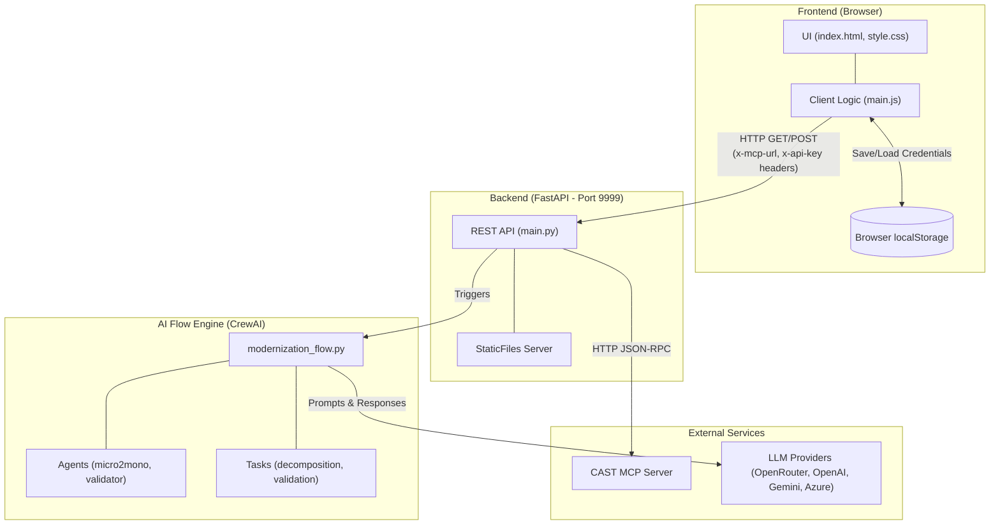

# Archaion Developer Playbook

Welcome to the internal developer guide for the Archaion Analyzer. This document covers how the architecture works, how to troubleshoot issues, and how to understand the data flow. 

*(If you are just looking for instructions on how to install and run the app, please read the `README.md` file instead).*

---

## 🏛 Architecture Overview

Archaion is designed as a **Stateless, Standalone Monolith** running entirely on Python. It securely bridges the gap between external code intelligence (CAST MCP) and generative artificial intelligence (LLMs) without requiring a database.

### System Architecture Diagram



---

## 🧩 Detailed Component Breakdown

### 1. Frontend (`app/frontend/`)
The frontend is built using standard HTML, CSS (featuring a modern Glassmorphism design), and Vanilla JavaScript. 
- **`index.html` & `style.css`**: Defines the user interface. It is completely decoupled from build tools (no Webpack, no React). 
- **`main.js`**: Handles all dynamic user interactions. 
- **State Management**: The frontend is responsible for security. It uses `localStorage` to securely save the user's CAST API keys and LLM keys locally in the browser.

### 2. Backend (`app/backend/`)
The backend is a high-performance **FastAPI** server running on port `9999`.
- **`main.py`**: Acts as the central router. It mounts the frontend files to the root `/` path using `StaticFiles`, meaning no separate frontend server is required.
- **Stateless Execution**: The backend receives credentials via HTTP headers (`x-api-key`, `x-mcp-url`) and JSON payloads from the frontend. It holds no persistent state.

### 3. AI Flow Engine (`app/flows/` & `app/agents/`)
This is the "brain" of Archaion, orchestrating the autonomous analysis.
- **`modernization_flow.py`**: A wrapper that initializes a **CrewAI** multi-agent system. It takes the application DNA and the user's mission parameters to construct a dynamic workflow.
- **`app/agents/config/`**: Contains the YAML definitions that dictate the strict behavior of the AI.
  - `agents.yaml`: Defines the `micro2mono_agent` (architect) and the `validator_agent` (quality gatekeeper).
  - `tasks.yaml`: Defines exactly what the agents must accomplish (decomposition and ISO 5055 validation).
- **Dynamic LLM Routing**: Depending on what the user selects in the UI (e.g., OpenAI vs Gemini), this engine dynamically configures the `litellm` router on the fly to process the prompts.

### 4. Integration (CAST MCP)
The backend acts as an HTTP client connecting to a remote CAST Imaging Model Context Protocol (MCP) server. The backend retrieves the application list (`/applications`), detailed architectural metrics (`/dna`), and structural flaws (`iso-5055-flaws`) on behalf of the AI agents.

---

## 🔄 Data Flow Example

1. The user opens `http://localhost:9999`.
2. The browser loads `index.html` and `main.js`.
3. The JavaScript fetches the user's stored keys from `localStorage`.
4. `main.js` sends an HTTP GET request to the backend (`/applications`), passing the user's CAST MCP URL and API key inside the HTTP headers (`x-mcp-url` and `x-api-key`).
5. The Python FastAPI backend receives the request, reads the headers, and securely forwards the request to the CAST MCP Server.
6. The CAST MCP Server returns a deeply nested JSON string.
7. The Python backend safely sanitizes the string and passes it back to the frontend.
8. The frontend parses the JSON and populates the user interface dynamically.

---

## 🛠 Troubleshooting Common Issues

### 1. "Failed to fetch" or Blank Screen
- **Issue**: The frontend cannot reach the backend.
- **Solution**: Ensure you are running the application using `uvicorn app.backend.main:app --host 0.0.0.0 --port 9999` (or using Docker). Archaion runs entirely on port `9999`.

### 2. "Port 9999 already in use"
- **Issue**: Another application (or an old crashed Archaion server) is still running in the background.
- **Solution (Windows)**:
  1. Open PowerShell.
  2. Find the hidden process: `netstat -ano | findstr :9999`
  3. Look at the last number on the line (the PID).
  4. Kill it: `taskkill /F /PID <PID_NUMBER>`
- **Solution (Mac/Linux)**:
  1. Find the process: `lsof -i :9999`
  2. Kill it: `kill -9 <PID_NUMBER>`

### 3. "No module named 'fastapi'"
- **Issue**: You are not running the application inside the virtual environment where the dependencies were installed.
- **Solution**: Make sure you have activated your virtual environment (`.\venv\Scripts\Activate.ps1` on Windows or `source venv/bin/activate` on Mac/Linux) before running the python command.

### 4. Application List is Empty but No Errors Show
- **Issue**: The CAST MCP credentials entered in the Settings UI are incorrect.
- **Solution**: Click the "⚙" button in the UI. Ensure the URL is correct (e.g., `https://presales-in.castsoftware.com/mcp`) and that there are no trailing slashes or hidden spaces in your API Key.

### 5. LLM Call Fails during "Initialize Agents"
- **Issue**: The selected LLM Provider and API key combination is invalid.
- **Solution**: Open the Settings UI. If you chose "OpenAI", ensure you pasted an OpenAI key (starting with `sk-...`). If you chose "Google Gemini", ensure it is a valid Gemini key. 

---

## 🔐 Using Environment Variables (Optional)

Archaion defaults to taking credentials securely from the UI. However, if you prefer using environment variables (e.g., for headless deployments or Docker overrides):
1. Copy `.env.example` to `.env`.
2. Fill in your default keys (e.g., `CAST_X_API_KEY`, `OPENROUTER_API_KEY`).
3. Start the application locally or via `docker-compose up`. The app will automatically fall back to these `.env` values if the user leaves the UI Settings blank.

---

## 📦 File Structure

```text
Archaion/
├── app/
│   ├── agents/          
│   │   └── config/      # YAML definitions for CrewAI roles and tasks
│   ├── backend/         # FastAPI server logic (main.py)
│   ├── flows/           # CrewAI/LiteLLM execution states
│   ├── frontend/        # HTML, CSS, JS static files
│   └── tools/           # Custom Python utilities (like the DOCX generator)
├── docker-compose.yml   # Docker Compose orchestration
├── Dockerfile           # Docker container build instructions
├── LICENSE.md           # Legal usage requirements
├── README.md            # User-facing installation guide
└── requirements.txt     # Python package dependencies
```